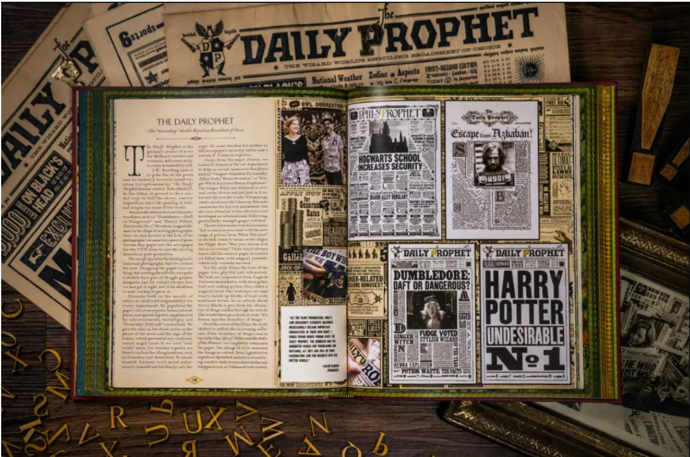
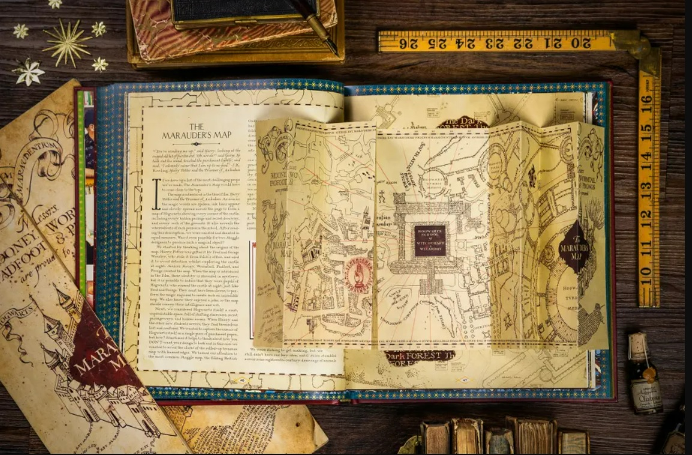
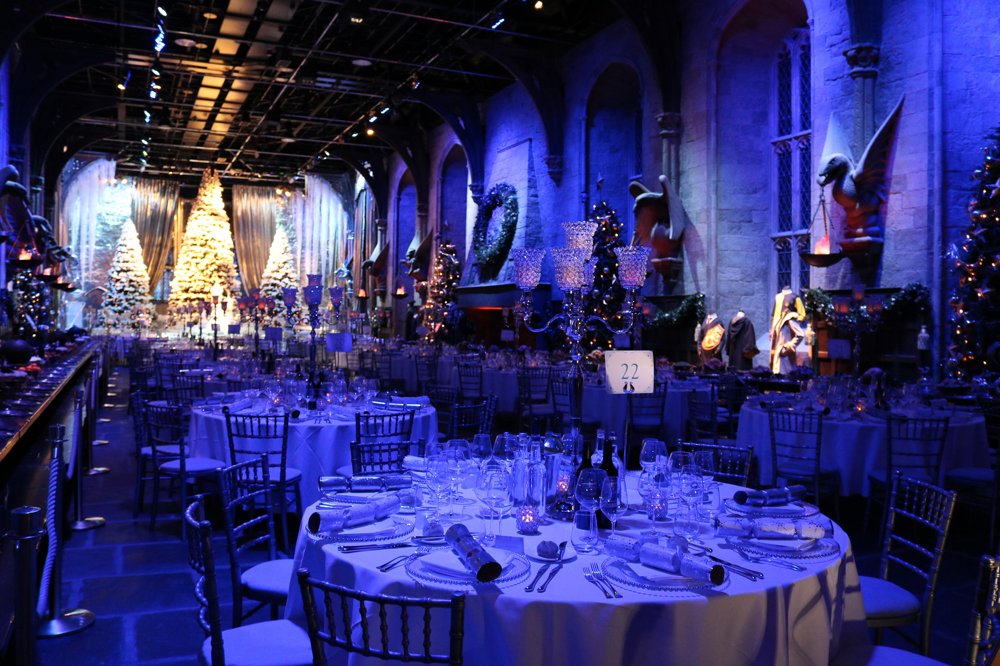

### Take a look inside MinaLima’s new twenty-year celebration book
The graphic design duo behind the Harry Potter and Fantastic Beasts films have a beautiful new book coming out, looking back at over two decades of behind-the-scenes creations across the Wizarding World. Let’s take a look inside.

Entitled The Magic of MinaLima: Celebrating the Graphic Design Studio Behind the Harry Potter & Fantastic Beasts Films, the design team’s latest publication goes more personal than you’ve seen before, revealing a scrapbook of letters that the designers sent to each other in the beginning, alongside concept art pieces and research documents that would lead to some of the most iconic props in the Wizarding World stories.

From the Hogwarts acceptance letter (handwritten by one half of the MinaLima duo, Mira) to the Daily Prophet newspapers, this gorgeously detailed compendium leaves no stone unturned when it comes to the meticulous level of thinking that went behind the magical objects you see in the Harry Potter and Fantastic Beasts films. Each page is an explosion of colour and imagination, as you can see here.

If you’re a budding artist looking for an inspirational story, this book certainly contains many.

 ### Festive season begins at Warner Bros. Studio Tour London for 2022
Wrap up warm and get ready for some Christmassy cheer, wizarding world-style. Warner Bros. Studio Tour London is back with its festive offerings, transforming the sets into winter wonderlands. 
Wrap up warm and get ready for some Christmassy cheer, wizarding world-style. Warner Bros. Studio Tour London - The Making of Harry Potter is back with its festive offerings, transforming the sets with a very merry makeover and once again inviting fans to dinner in the Great Hall.

As is tradition, the Great Hall set will soon be transformed into a winter wonderland, complete with shimmering silver, dripping icicles and sparkling snow. Look around and you’ll see specially decorated Christmas trees and an orchestra of magical instruments (painted by the Prop-Making department) will also be on display, to give the impression you are visiting Hogwarts in the time of the Triwizard Tournament.

The Studio Tour is also set to put on some lavish special events in the Great Hall from 13th December – 15th December, inviting guests to enjoy a delicious Christmas feast. Fans can look out for tickets for Dinner in the Great Hall from 10am BST on Thursday 29th September. And if you’re signed up with us, you even get a 24 hour window to snap up a limited number of tickets before general sale! Harry Potter Fan Club Members can keep an eye out tomorrow (Wednesday 28th September) at 10am BST.

Beyond the Great Hall, the glamorous costumes of the Yule Ball scene from Harry Potter and the Goblet of Fire will be on display, inviting fans to see the works of Costume Designer Jany Temime. Learn about how some of the outfits were created too, such as Hermione’s iconic pink dress, which featured twelve metres of delicate Chiffon to create such a stunning effect.

New for 2022, the Hogwarts Castle fountain will be given a wintery makeover to match the cobbled stones and magical shop fronts of Diagon Alley, Hagrid’s Hut and the Hogwarts Castle model. During filming, a member of the crew climbed aboard an elevated work platform and sprinkled the ‘snow’ mixture of granulated paper and grains of salt onto the model by hand with a sieve – like dusting sugar onto a cake. The same process takes place at the Studio Tour every festive season. Many different types of ‘snow’ were used during filming, each selected for its ability to crunch under foot, float like falling snowflakes, or glisten in the light like ice, but never melt.

